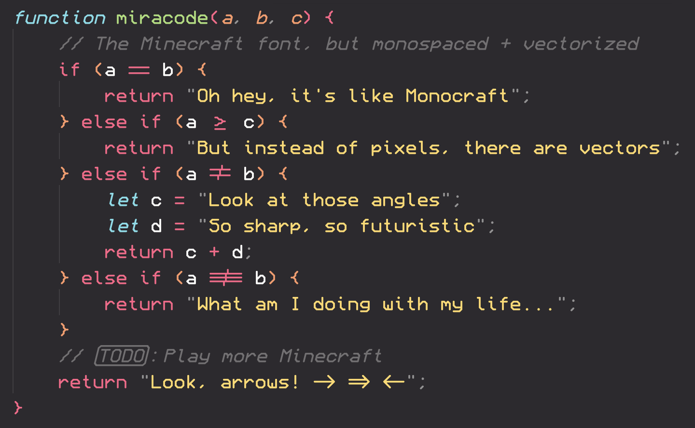
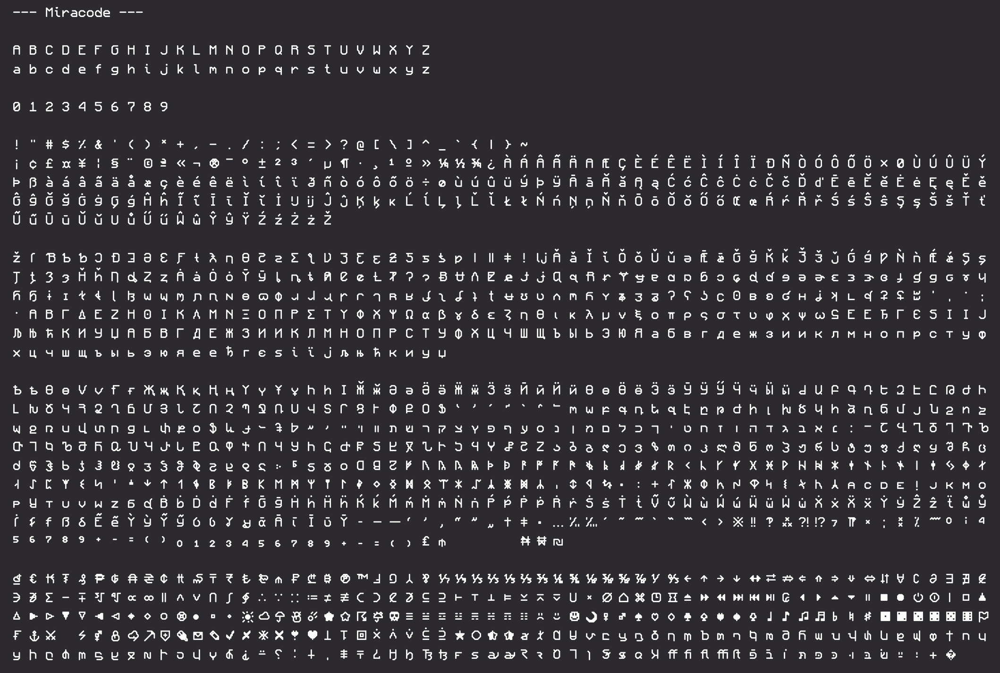
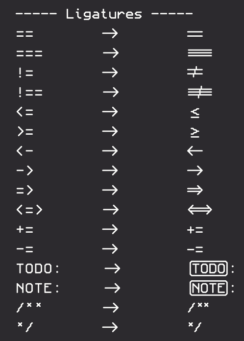

# Miracode

[](https://GitHub.com/IdreesInc/Miracode/releases/)

[](https://GitHub.com/IdreesInc/Miracode/releases/)


The font for those who like [Monocraft](https://github.com/IdreesInc/Monocraft) but want to be able to read what they type!



[Follow me](https://github.com/IdreesInc/IdreesInc) for updates on this and other projects!

## Features

- Like Monocraft, but readable!
  - The characters in this font are based on [Monocraft](https://github.com/IdreesInc/Monocraft) which is based on the typeface used in the Minecraft UI
  - Each of the 1500+ glyphs included in this font have been carefully redesigned to work in a monospaced font
  - Thin characters like "i" and "l" have been reworked with tasteful tails and serifs to look better in a monospaced environment
- Angular!
  - Miracode uses a special algorithm to convert the pixels that make up each character into a series of lines and curves. This gives each character a unique, angular look that is sure to make your code stand out
- Programming ligatures!
  - Add some spice to your programming life with all new ligature characters
  - Arrows now look like arrows and comparison operators are easier to see at a glance
  - Plus, Miracode includes some ligatures that are not available in Monocraft such as a ligature for "TODO:" and "NOTE:"

## Glyphs



## How to install

### Windows

Download the most recent `Miracode.ttf` file from the [Releases](https://github.com/IdreesInc/Miracode/releases) page. Right click on the downloaded font and select **Install**. You might need administrative access to install fonts, depending on your machine.

### Mac

<!-- #### Using Homebrew

```shell
brew tap homebrew/cask-fonts
brew install --cask font-monocraft
``` -->

<!-- #### Manually -->

Download the most recent `Miracode.ttf` file from the [Releases](https://github.com/IdreesInc/Miracode/releases) page. Double click on the downloaded font file and select **Install Font** in the window that appears. More help available [here](https://support.apple.com/en-us/HT201749).

### Linux

Download the most recent `Miracode.ttf` file from the [Releases](https://github.com/IdreesInc/Miracode/releases) page. Move the file to ~/.local/share/fonts (create the folder if it doesn't already exist). In a terminal, run `fc-cache -fv`. Alternatively, log out and log in again. 

## How to use

After following the installation instructions up above, simply select the "Miracode" font (note the space) in any application that supports custom fonts. You might need to restart the application or your computer for the font to appear.

## FAQ

### What ligatures are available?



### How are these characters generated?

Using [FontForge's](https://fontforge.org/en-US/) excellent Python extension, the glyphs are created from configuration files representing each character's pixels. Diacritics are created separately and are combined with the original characters to create over 1500 unique glyphs. To learn more, check out the source code in the [src](https://github.com/IdreesInc/Miracode/tree/main/src) folder.

### How do I contribute?

Unlike Monocraft, this font was made specifically with my use cases in mind and as such includes more weird features that Monocraft lacks. If you have any suggestions or improvements, feel free to open an issue or a pull request, but I can't guarantee that I'll accept every change!
